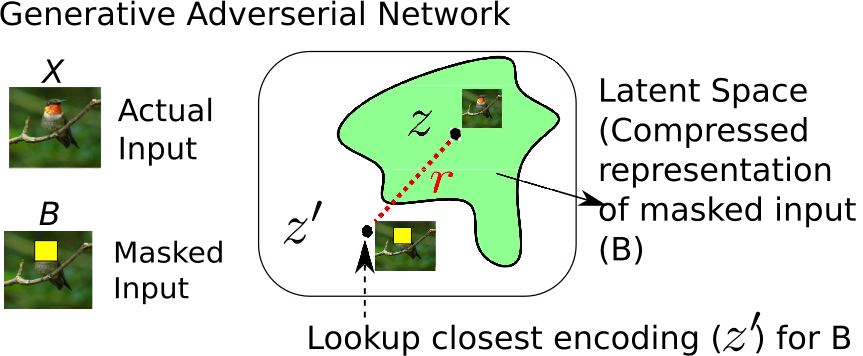
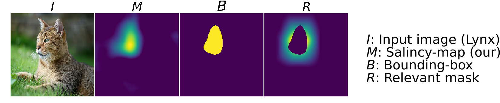
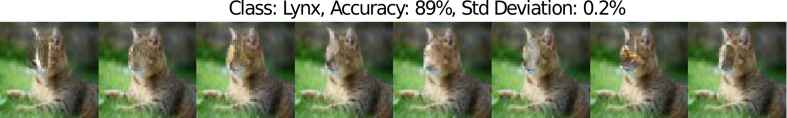

## Generalizable Saliency
This repository contains source code necessary to reproduce some of the main results in the paper:

[Shailja Thakur](https://uwaterloo.ca/embedded-software-group/people-profiles/shailja-thakur), [Sebastian Fischmeister](https://uwaterloo.ca/embedded-software-group/people-profiles/sebastian-fischmeister) (ICPR, 2020)  
[A generalizable saliency map based model outcome explanation](https://arxiv.org/abs/2006.09504)

**If you use this software in an academic article, please consider citing:**

    
    @inproceedings{thakur2020generalizable,
      title={A generalizable saliency map-based interpretation of model outcome},
      author={Thakur, Shailja and Fischmeister, Sebastian},
      year={2020},
      booktitle={Proceedings of the International Conference on Pattern Recognition (ICPR)}
    }

## Problem
A limitation with saliency-map-based explanation is that it lacks consistency.

## Method overview

A method to generate alternate explanations for the part of the input, which is salient for target-specific classification. Alternate explanations are the variations of the pixels in the salient regions of the input for which the model prediction remains unaltered. The hypothesis for finding variations of the salient region comes from the analogy that the model is invariant to small perturbations in the input. To generate alternative explanations for the salient regions of the input, I applied the technique used in prior work on image completion technique (https://arxiv.org/abs/1604.07379) that uses a generator to find the latent space features closest in encoding to the neighboring pixels to reconstruct the pixels in the salient regions of the input. Using this approach, we are able to find an exhaustive and contextually similar set of transformations for the pixels in the semantic regions, which are classified to the same output class as the original input image.

<!--  -->

## Repository contents
* The whole idea is implemented in [saliency-variations-prototype.ipynb](Generate(224x224)-alternate-explanations-of-mask.ipynb) notebook, it's done in Keras, and can be easily tweaked to work using other framework as it is model-agnotic in nature.
<!-- * [Saliency](Saliency.ipynb) notebook demonstrates the usage of RISE class optimized for PyTorch. -->
<!-- * [Evaluation](Evaluation.ipynb) notebook displays another contribution of the paper: *Causal metrics*. -->

## Examples 

# Masking Relevant pixels

# Acceptable Generated Variations  

